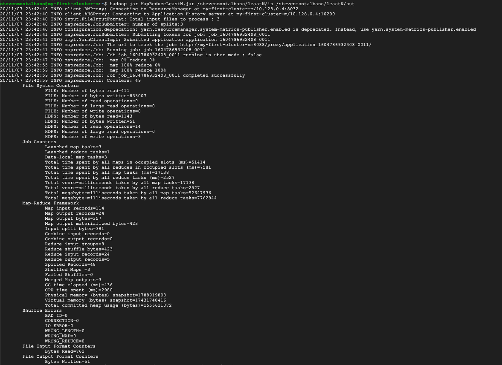
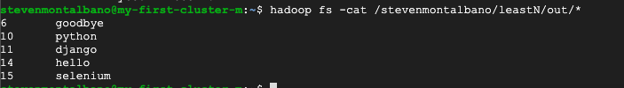

# MapReduce Least-N Algorithm

### Source Code
[Driver.java](src/Driver.java)
[LeastNMapper.java](src/LeastNMapper.java)
[LeastNReducer.java](src/LeastNReducer.java)

### Built JAR File
[MapReduceLeastN.jar](MapReduceLeastN.jar)

### Input Files
[file1.txt](input/file1.txt)
[file2.txt](input/file2.txt)
[file3.txt](input/file3.txt)

### GCP Account

### Execution

### Execution Results
